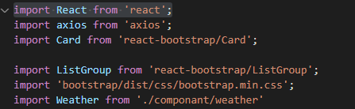
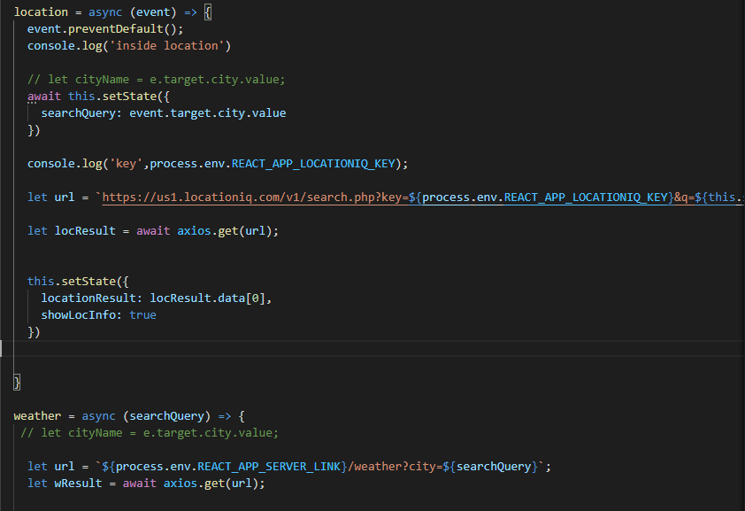
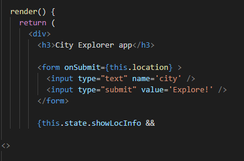

As we all know the white Box Testing is a software evaluating approach that involves testing the product's underlying structure, architecture, and code in order to validate input-output flow and enhance the design, usability, and security. 

First of all, we should test the tools and the techniques we used so I started to check from the libraries I used are installed in the right way also if I import these libraries to be able to use them in my code

Now I will check from the validate of the functions so in these two arrow functions which should retrieve the data from the API the location and the weather for the city.

also, I checked from this function that is responsible to render the data on the page.

in addition, I make sure there are no syntax errors or even logical errors also use the console log to check from the resulting of the output.
I would mention the debugger tool in the vs code It was so helpful to me in testing and catching the errors where exactly, I used the debugger after and during write the code.
